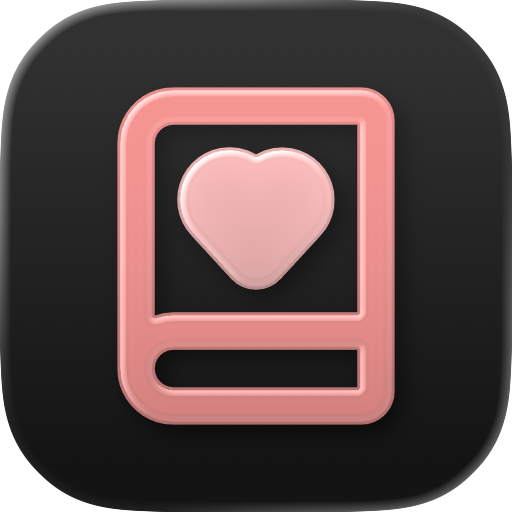
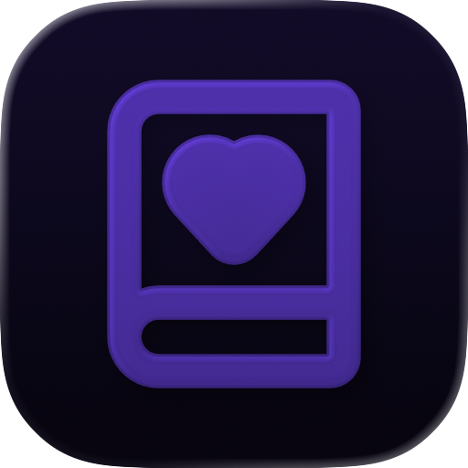
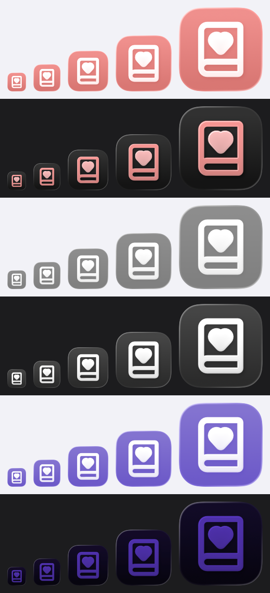

# App icon 素材

「我的記帳本」iOS 版的 app icon(#17)。以 web 版 sidebar 上的 lucide `BookHeart` 圖示和品牌粉 `#FF8A8A` 為基礎，做成 Icon Composer 的 Liquid Glass 分層 icon。規範見 `DESIGN.md`「App icon」一節。

**狀態**:素材完成，**等使用者審核外觀**。還沒接到 app target,要等 #4 建好 Xcode 專案後再接，步驟見下方〈接到 app target〉。

## 預覽

以下圖片都由 Xcode 內附的 Icon Composer 命令列工具 `ictool`(Icon Composer 1.6,Xcode 26.6)從 `AppIcon.icon` 算出來，不是手工合成的近似圖。產生方式見〈重新產生〉。

| Default | Dark | Clear(淺色 / 深色) | Tinted(淺色 / 深色) |
|---|---|---|---|
|  |  |   |   |

- HIG 的 iOS 外觀規格有六種:default、dark、clear light、clear dark、tinted light、tinted dark,所以 clear 和 tinted 各附淺色與深色兩張。
- Clear 的背景是 `ictool` 預設的灰色。實機上會透出桌布。
- Tinted 用的是 `ictool` 預設的紫色 tint。實機上會換成使用者選的顏色。

小尺寸檢查([`preview/sizes.png`](preview/sizes.png)):由上到下依序是 default、dark、clear light、clear dark、tinted light、tinted dark;由左到右是 40、58、87、120、180 px,也就是 20 pt @2x(通知)、29 pt @2x 與 @3x(設定)、60 pt @2x 與 @3x(主畫面)。每一格都由 `ictool` 直接算出該尺寸，沒有縮放。



## 設計說明

### 圖形

以 lucide `book-heart.svg` 的兩條 path(書、愛心)為基礎，只調整粗細和填色，不改形狀:

| 項目 | lucide 原檔 | app icon | 理由 |
|---|---|---|---|
| 線寬 | 2(24 格線) | **2.5** | lucide 的線寬是給 24 px 的 UI 圖示用的。app icon 最小會縮到 40 px,這時書只剩約 26 px 高，原本的線寬只有約 2.3 px,在系統加上的高光與模糊下會太細。改成 2.5 後約 2.9 px。HIG:「avoid extremely thin line weights」 |
| 愛心 | 空心線條 | **實心** | 實測空心愛心在 40 px 時只剩一個小圈，中間的洞幾乎看不見;實心在各尺寸都清楚。HIG:「Consider basing your icon design around filled, overlapping shapes」 |
| 線條 | stroke | **轉成填色外框** | HIG:「Outline artwork」。實測直接給 `ictool` 帶 stroke 的 SVG,算出來的轉角和端點跟瀏覽器不一樣:書的圓角變成直角，愛心變成盾牌形。所以一定要先轉成外框 |
| 大小與位置 | 24×24 | 1 單位 = 30 px,置中 | 書的外框是 555×675 px,約佔 1024 畫布的 66%,四周留給系統的圓角遮罩 |

外框化由 [`tools/build-layers.swift`](tools/build-layers.swift) 用 CoreGraphics(`copy(strokingWithWidth:lineCap:lineJoin:miterLimit:)`)計算，參數都寫在檔案開頭。

### 圖層

| 層 | 內容 | 設定 |
|---|---|---|
| 前:`Heart` group | `Assets/2-heart.svg`,白色實心愛心 | Liquid Glass 開、translucency 25%、neutral shadow 50% |
| 後:`Book` group | `Assets/1-book.svg`,白色書本外框 | 同上 |
| 背景 | `icon.json` 的 `fill`,不是圖片 | 由上往下 `#FF8A8A` → `#E87070` 的線性漸層 |

- `icon.json` 的 `groups` 陣列中，第一個 group 在最上層(已用重疊色塊實測確認)。
- 愛心獨立成一個 group,讓系統在書與愛心之間算出景深。
- Translucency 設為 25%。實測 50% 會讓白色圖形透出太多粉紅，和背景的對比不足;關掉又太平。25% 仍保有玻璃感，白色也夠清楚。
- 陰影、高光、模糊都交給系統，不畫在 SVG 裡(HIG:「Let the system handle blurring and other visual effects」)。

### 背景為什麼用漸層

`DESIGN.md` 的「品牌只保留 logo 和 accent 色，其餘一律使用系統外觀」指的是 app 介面。app icon 本身就是 logo,所以用品牌色。漸層的理由:

1. **Icon Composer 本來就支援漸層背景**。HIG 說「Icon Composer supports solid colors and gradients for background layers」,也建議「Prefer a simple background, such as a solid color or gradient」。漸層是在 `icon.json` 的 `fill` 裡設定，不是自己畫進圖片，所以不違反「不要自己畫效果」的原則。
2. **跟系統的打光搭配**。HIG:「If you choose a gradient for your background layer, ensure that it responds well to system lighting effects」。實測純色背景在系統高光下看起來比較平，上淺下深的漸層比較有深度。
3. **只用 web 既有的品牌色**:上方是品牌原色 `#FF8A8A`,下方是深一階的 `#E87070`,不另外發明顏色。白色對 `#FF8A8A` 只有 2.27:1,對 `#E87070` 是 3.0:1,下半部加深後，書的下緣更清楚。
4. **沒有用 Icon Composer 的 automatic gradient**(只給一個顏色，由系統自動產生漸層)。實測以 `#FF8A8A` 產生時，上方會提亮到接近 `#FFB3B3`,白色圖形在那裡的對比只剩約 1.7:1。

`icon.json` 沒有設定漸層方向(`orientation`)。實測 `ictool` 會忽略背景漸層的 `orientation`,方向只由顏色的順序決定(第一個顏色在上方)。

### 各外觀

- **Default**:粉色漸層背景，白色書本和愛心。
- **Dark**:背景用系統自動產生的深色。書改成品牌原色 `#FF8A8A`(也就是 `DESIGN.md` 深色模式的 accent 色),愛心用淺一階的 `#FFB3B3`,讓愛心成為視覺焦點。不指定的話，系統自動產生的粉色比較暗、比較灰(實測書的左側約為 `#CA7875`),所以這裡明確指定。
- **Clear、Tinted**:由系統從圖形自動產生，不另外指定。HIG:「the system automatically generates variants you don't provide」。
- 各外觀的圖形都一樣，只換顏色(HIG:「keep your icon's core visual features the same」)。
- 完全不使用 SF Symbols。SF Symbols 的授權禁止用在 app icon。

## 檔案

```text
design/app-icon/
├── README.md
├── AppIcon.icon/              # Icon Composer 文件(資料夾 bundle),之後整包搬進 app target
│   ├── icon.json              # 背景、group、Liquid Glass 效果、各外觀的顏色
│   └── Assets/
│       ├── 1-book.svg         # 由 tools/build-layers.swift 產生
│       └── 2-heart.svg        # 由 tools/build-layers.swift 產生
├── upstream/
│   └── lucide-book-heart.svg  # lucide 原檔，未修改
├── tools/
│   ├── build-layers.swift     # lucide 原檔 → Assets/*.svg
│   └── render-previews.swift  # AppIcon.icon → preview/*.png(呼叫 ictool)
└── preview/                   # ictool 算出的預覽圖
```

## 重新產生

在 repo 根目錄執行:

```bash
# 1. 改了線寬、大小，或換了 lucide 原檔之後，重新產生前景 SVG
swift design/app-icon/tools/build-layers.swift

# 2. 重新算預覽圖(會覆寫 preview/)
swift design/app-icon/tools/render-previews.swift

# 3. 用 actool 編譯一次，確認 Xcode 讀得懂(會實際產出 Assets.car)
mkdir -p /tmp/appicon-check
xcrun actool design/app-icon/AppIcon.icon --compile /tmp/appicon-check \
  --platform iphoneos --minimum-deployment-target 26.0 --app-icon AppIcon \
  --target-device iphone --target-device ipad \
  --output-partial-info-plist /tmp/appicon-check/partial.plist \
  --output-format human-readable-text --errors --warnings --notices
```

- `ictool` 在 `Xcode.app/Contents/Applications/Icon Composer.app/Contents/Executables/ictool`。`render-previews.swift` 會從 `xcode-select -p` 找，也可以用環境變數 `ICTOOL` 指定。
- `ictool` 只負責算圖，不做驗證:`image-name` 指向不存在的檔案時，它照樣回傳成功。**驗證要用第 3 步的 `actool`**。它遇到壞掉的 `icon.json` 會報錯，而且不產出任何檔案。
- 要微調 Liquid Glass 效果時，可以用 Icon Composer 打開 `AppIcon.icon`。存檔後 `icon.json` 可能會被重新排版，這是正常的。之後重跑 `build-layers.swift` 只會覆寫 `Assets/` 裡的兩個 SVG,不會動到 `icon.json`。

## 接到 app target(等 #4 合併後)

1. 把 `.icon` 搬進 app 的 buildable folder。Xcode 會自動把它加進 target:

   ```bash
   git mv design/app-icon/AppIcon.icon src/App/MyMoney/AppIcon.icon
   ```

   接著把 `tools/build-layers.swift` 的 `assetsDir`、`tools/render-previews.swift` 的 `iconDocument` 改成新位置。
2. 在 app target 的 General › App Icons and Launch Screen,確認 App Icon 欄位是 `AppIcon`(也就是 build setting `ASSETCATALOG_COMPILER_APPICON_NAME = AppIcon`)。這個名稱必須和 `.icon` 的檔名(不含副檔名)一致。
3. 如果 Xcode 範本在 `Assets.xcassets` 裡建立了空的 `AppIcon.appiconset`,把它刪掉。新版 Xcode 會優先使用 Icon Composer 文件，留著 appiconset 只會造成混淆。
4. 用 `xcodebuild` 建置，確認零 warning。然後在 iPhone 17 模擬器的主畫面，檢查 default、dark、clear、tinted 四種外觀(長按主畫面 › 編輯 › 自訂)。
5. 在 PR 附上模擬器主畫面的截圖。使用者同意後才關閉 #17。

## 授權

`upstream/lucide-book-heart.svg` 取自 [lucide](https://github.com/lucide-icons/lucide) 的 `icons/book-heart.svg`,最後修改的 commit 是 `05dd5fcfde07c36f6f113c6bc690802dcce8da15`(2025-07-31),內容與 2026-09-28 的 `main`(`66d8f9fc394b8530377e5f6112f0b8908ba01280`)相同。`AppIcon.icon/Assets/` 裡的兩個 SVG 是由它衍生的作品(加粗、外框化、愛心改成實心、放大)。

lucide 的授權如下。lucide 的 LICENSE 另外列了一批沿用自 Feather 的圖示，那些適用 MIT License;`book-heart` 不在那份清單裡，所以只適用 ISC License。

```text
ISC License

Copyright (c) 2026 Lucide Icons and Contributors

Permission to use, copy, modify, and/or distribute this software for any
purpose with or without fee is hereby granted, provided that the above
copyright notice and this permission notice appear in all copies.

THE SOFTWARE IS PROVIDED "AS IS" AND THE AUTHOR DISCLAIMS ALL WARRANTIES
WITH REGARD TO THIS SOFTWARE INCLUDING ALL IMPLIED WARRANTIES OF
MERCHANTABILITY AND FITNESS. IN NO EVENT SHALL THE AUTHOR BE LIABLE FOR
ANY SPECIAL, DIRECT, INDIRECT, OR CONSEQUENTIAL DAMAGES OR ANY DAMAGES
WHATSOEVER RESULTING FROM LOSS OF USE, DATA OR PROFITS, WHETHER IN AN
ACTION OF CONTRACT, NEGLIGENCE OR OTHER TORTIOUS ACTION, ARISING OUT OF
OR IN CONNECTION WITH THE USE OR PERFORMANCE OF THIS SOFTWARE.
```
